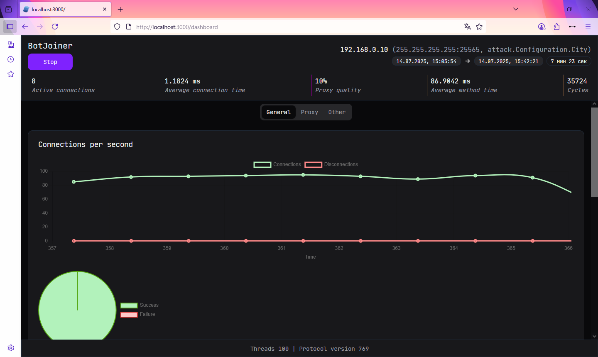
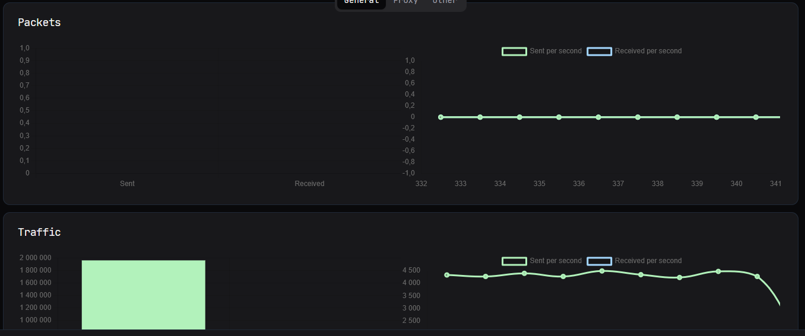
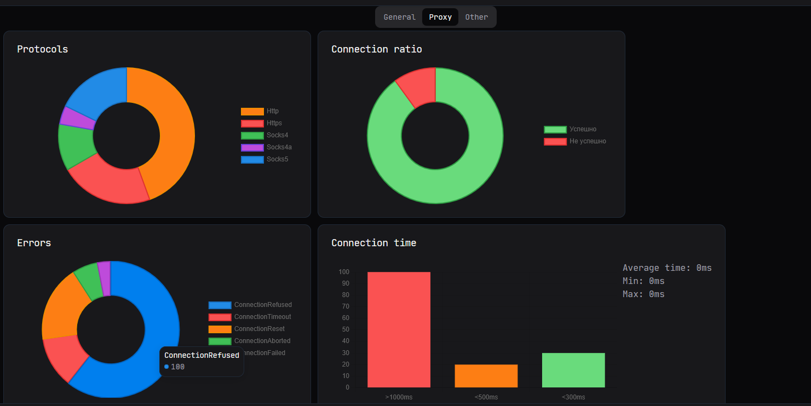
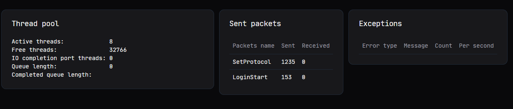

> 🇬🇧 [Read in English](./en.md)

# Статус проекта — Holy Client

**Последнее обновление:** 6 февраля 2024  
**Текущий статус:** Не поддерживается

## Почему развитие остановилось

Проект **Minecraft Holy Client** не получал обновлений уже более года.  
Это связано с тем, что клиент изначально разрабатывался на C#, и со временем код стал тяжело поддерживаемым: добавление новых фич превращалось в головную боль из-за технического долга и устаревшей архитектуры.

В декабре 2024 года я решил полностью переключиться на разработку библиотеки **[McProtoNet](https://github.com/Titlehhhh/McProtoNet)**.  
Примерно к февралю 2025 года я добавил в неё полноценную поддержку мультиверсий и немного упростил архитектуру. Теперь библиотека находится в хорошем состоянии.

## Что дальше?

После того как McProtoNet стал стабильным, я пересмотрел будущее Holy Client и пришёл к выводу, что проще полностью переписать его с нуля.  
Вместо старой архитектуры я начал работать над **новой версией клиента в формате "клиент-сервер" с веб-интерфейсом**. Это также позволило мне глубже изучить веб-технологии.

На данный момент я сосредоточен на разработке **нового клиента**.  
До его выхода в open-source исходный Holy Client останется **замороженным и не будет обновляться**.

## FAQ

**Будет ли новая версия с открытым исходным кодом?**  
Да, как только она будет готова для использования.

**Почему разработка так затянулась?**  
Я работаю над проектом в свободное время, параллельно с учёбой и личными делами.

**Что будет нового?**  
- Поддержка мультиверсий (1.12.2 - по последнюю вресию)
- Атака методами (BotJoiner, Memory)
- Больше обратной связи от стресс-теста

Это все основные функции, которые я, по крайней мере, планирую добавить в новую версию. Я не даю никаких гарантий, но постараюсь за летнее время реализовать это.

**Поддержка GUI на десктопе**   
Я пока обдумываю это, но моя новая архитектура мне позволит это сделать, хотя это может усложнить разработку, так как нужно будет параллельно делать сразу два GUI. Возможно кто нибудь в будущем займется этим и даже сделает мод для майнкрафта. Это даст больше экпириенса. Я постараюсь покрыть документацие API.

---

## Скриншоты (в разработке)

*Некоторые данные фейковые, например, прокси*

---
